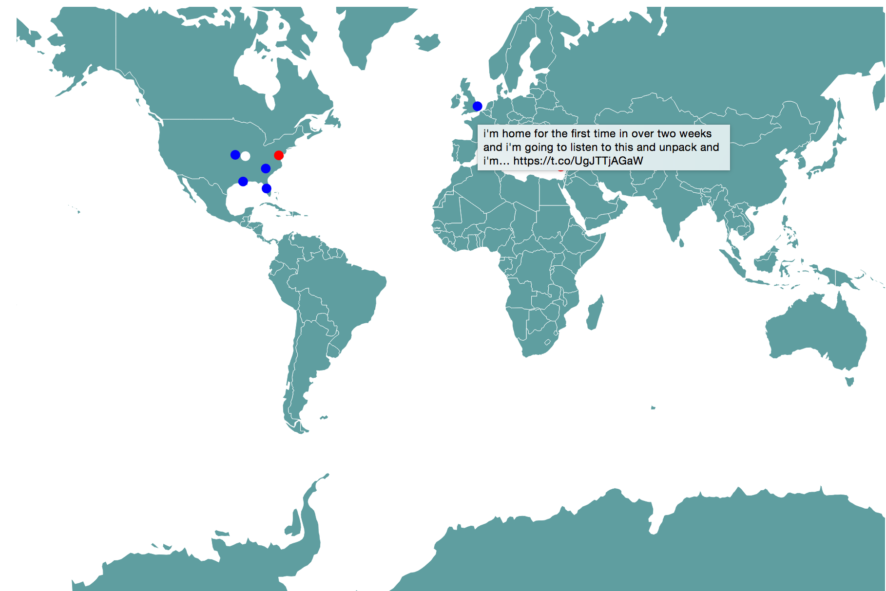

# storm-twitter-sentiment-visualization 

A visualization of real time twitter sentiment powered by storm and d3

## Steps to Run
1. `vagrant up`
2. `vagrant ssh`
3. `cd /vagrant`
4. `mvn compile assembly:single`
5. `storm jar target/storm-twitter-sentiment-visualization-0.0.1-SNAPSHOT-jar-with-dependencies.jar storm.starter.TweetTopology`
6. `cd /vagrant/viz in another tab/terminal window`
7. `python app.py`
8. Navigate to `localhost:5000`
9. See Viz 

## Visualization Key
A circle for each tweet is plotted at the latitude and longitude from which it originated. Blue is positive emotion, red is negative, and white is neutral.
A tooltip over each circle shows the original tweet.

## Projects used
1. Twitter4j API
2. Apache Storm 
3. text-processing.com for sentiment analysis(todo-replace this)
4. d3.js for visualization
5. Redis for message passing

